# Lab 1: Containerlab & Wireshark

Der [Network Protocol Analyzer _Wireshark_](https://wireshark.org) ist die am meisten genutzte Software für die Netzwerk Paketanalyse. Wireshark ist ein Open Source Programm, das für private und kommerzielle Zwecke frei genutzt werden kann. Ein Network Protcol Analyzer kann Netzwerk Pakete aufzeichnen sowie die in den Paketen übertragenen Netzwerkprotokolle analysieren und unterstützt Netzwerkadminstratoren somit bei der Fehlersuche. Die Funktionen von Wireshark sind auch hervoragend geeignet, um den Aufbau von Netzwerkframes, -paketen und -segmenten sowie die Funktionsweise von Netzwerkprotokollen auf den verschieden Schichten des ISO/OSI Modells darzustellen, weshalb _Wireshark_ hervorragend für Ausbildungszwecke geeignet ist.

In dieser Übung gehen wir die ersten Schritte mit Wireshark. Hierzu arbeiten wir wieder mit Containerlab im GitHub Codespace, starten ein Labornetzwerk und zeichen mit Wireshark einen _Ping_ von PC1 nach PC3 auf.

!!! info
    Der _Ping-Befehl_ basiert auf dem _ICMP-Protokoll_, welches im Rahmen dieses Kurses zu einem späteren Zeitpunkt detailliert behandelt wird. Für den Moment soll genügen, dass der Ping-Befehl genutzt werden kann, um z.B. die Funktion einer Netzwerkverbindung zwischen zwei Endgeräten im Netzwerk zu überprüfen. Hierzu schickt ein Endgerät einen sog. _Ping-Request_ an ein anderes Endgerät im Netzwerk. Funktioniert die Netzwerkverbindung, erreicht der Ping-Request des ersten Endgeräts das zweite Endgerät und letzteres antwortet auf den empfangenen _Ping-Request_ mit einem _Ping-Reply_ an das erste Endgerät.

    Ein Ping, z.B. von PC1 nach PC3 wird auf der Kommandozeile von PC1 durch die Eingabe des Befehls `ping 192.168.12.11` gestartet, wobei `192.168.12.11` die IP-Adresse von PC3 darstellt, über welche PC3 für andere Endgeräte im Netzwerk erreichbar ist.

/// caption
Lab Topology
///

Die dafür notwendigen Schritte sind:

- VS Code mit GitHub Codespace verbinden
- Containerlab _Lab-2_ starten (Deploy)
- Mit Kommandozeile von PC1 verbinden
- _Edgeshark_ im GitHub Codespace starten
- Ping-Befehl zwischen PC1 und PC3 starten
- Ping-Pakete zwischen PC1 und PC3 mit Wireshark aufzeichen
- Ping-Befehl und Wireshark-Aufzeichnung stoppen
- Paketaufbau Ping Request Paket
- Paketaufbau Ping Response Paket
- Containerlab _Lab-2_ stoppen (Destroy)
- _Edgeshark_ stoppen
- _GitHub Codespace_ stoppen

## VS Code mit GitHub Codespace verbinden

VS Code starten und Verbindung zum GitHub Codespace des clab-lankurs Repositories herstellen, analog zur Vorgehensweise in der [Übung Lab 0](lab0.md#lab-0-laborumgebung-mit-containerlab)

## Containerlab _Lab-2_ starten (Deploy)

- Containerlab-Bereich auswählen (über Containerlab Symbol im linken Randmenü)
- Im Bereich `UNDEPLOYED LOCAL LABS` das Verzeichnis `student/lab-2` öffnen
- Rechtsklick auf Datei `topology.clab.yml` und Start des Labors über Menüeintrag `Deploy`
- Optional: Im Informations-Dialog unten rechts `View Logs` klicken, danach kann man die Logmeldungen während des Starts im Bereich `OUTPUT` beobachten:
    * Fehlende Conatainer-Images werden aus der GitHub Docker Registry `ghcr.io` heruntergeladen und gespeichert
    * Labor Nodes werden gestartet und Verbindungen zwischen den Nodes etabliert
- Nach dem Start im Bereich `RUNNING LABS`:
    * Node Status wird farbig bzw. als `Up`/`Down` angezeigt
    * Status der einzelen Nodes durch _aufklappen_ des Labs angezeigt
- Alternativ kann die ausgewähle Topology Datei über die folgende Tastenkombination _deployed_ werden: ++ctrl+alt+d++

??? info "Screenshots: _Lab starten_"
    
    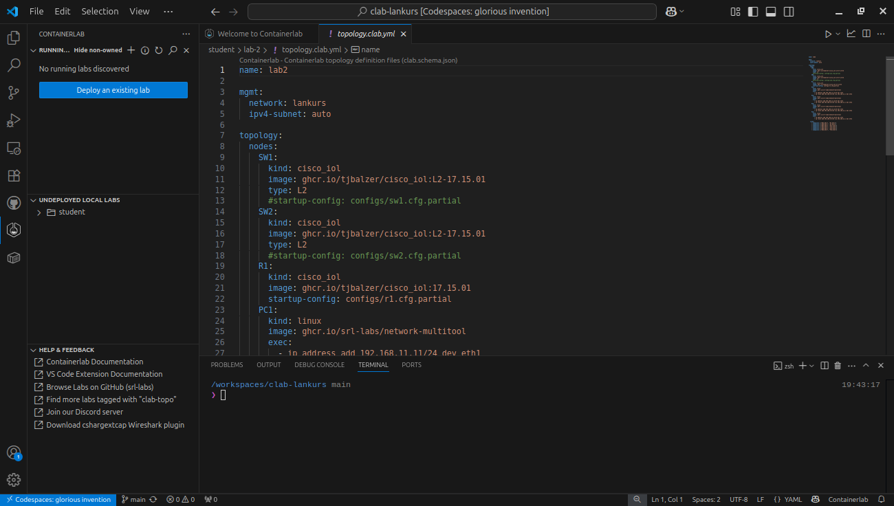
    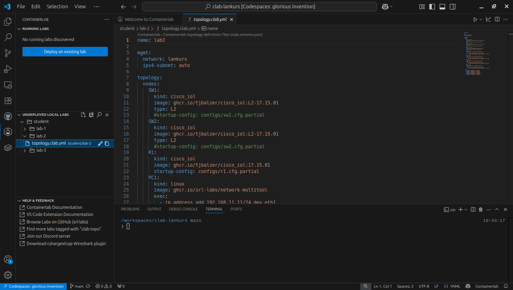
    
    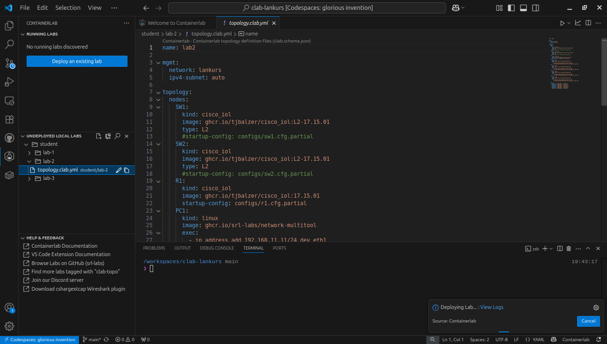
    
    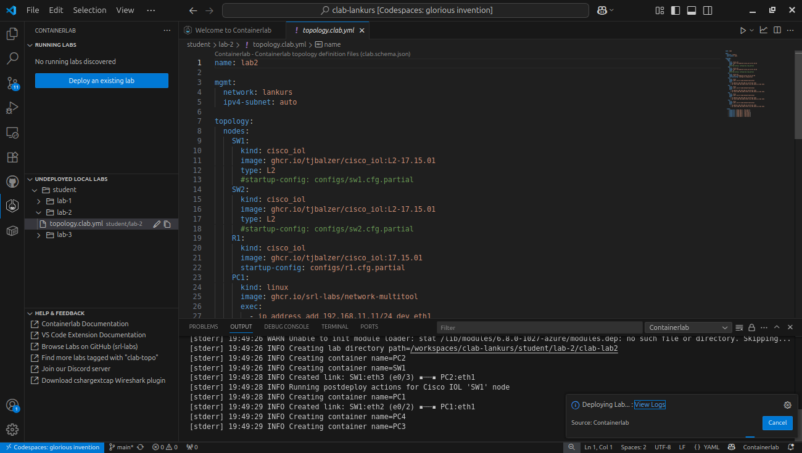
    
    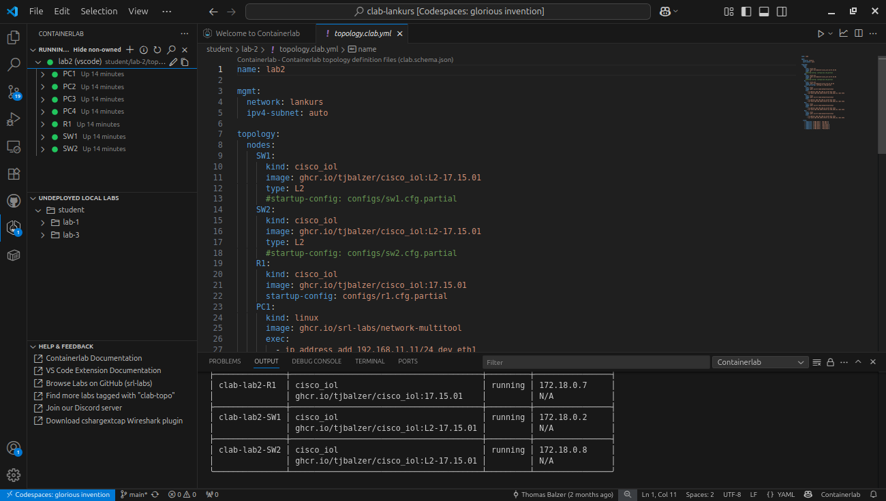

## _Edgeshark_ im GitHub Codespace starten

Wireshark läuft im Rahmen dieses Kurses auf lokalen Notebooks im Schulungsraum. Da unsere Labornetzwerke entfernt in einem GitHub Codespace in der Microsoft Azure Cloud laufen, müssen wir dafür sorgen, dass die entfernten Netzwerkpakete an die lokale Wireshark-Instanz geschickt werden. Hierzu wird auf der entfernten virtuellen Maschine (der GitHub Codespace) die Open Source Software [Edgeshark](https://edgeshark.siemens.io) in Form eines Docker Containers gestartet.

Edgeshark liest die Netzwerkpakete auf den Verbindungen der einzelnen Netzwerkcontainer in unserer Lab-2 Containerlab Topolology und überträgt die Pakete an das `cshargextcap`-Plugin von Wireshark auf dem lokalen Schulungs-PC oder Smart Client (auf den SmartClients wurde das `cshargextcap`-Plugin während der Durchführung der Maßnahmen in der Sektion [Vorbereitungen](vorbereitungen.md) installiert.

_Edgeshark_ wird über die [_VS Code_](https://code.visualstudio.com/) _Command Palette_ wie folgt im GitHub Codespace gestartet:

- _VS Code Command Palette_ über ++ctrl+shift+p++ aufrufen
- `edgeshark` in der Eingabezeile der _VS Code Command Palette_ eingeben
- Befehl `Containerlab: Install Edgeshark` aus der Liste auswählen
- Edgeshark Container wird bei Bedarf aus dem Internet geladen, lokal gespeichert und gestartet
- Nach dem erfolgreichen Start von _Edgeshark_ können Paketaufzeichnungen gestartet und die aufgezeichneten Paket lokal in Wireshark angzeigt werden (Wireshark wird automatisch nach dem Start der Paketaufzeichnung im entfernten Containerlab Labor lokal gestartet)

??? info "Screenshots: _Edgeshark im GitHub Codespace starten_"
    
    
    
    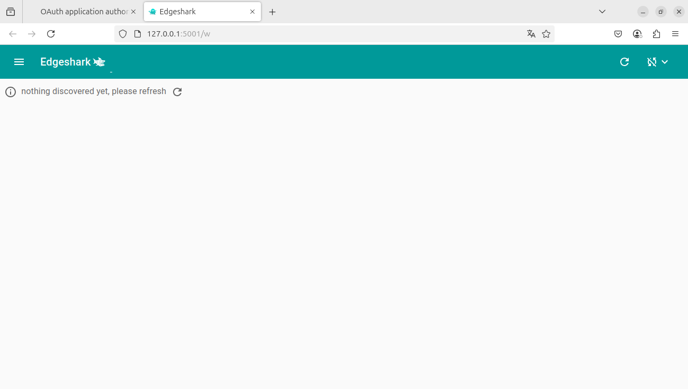
    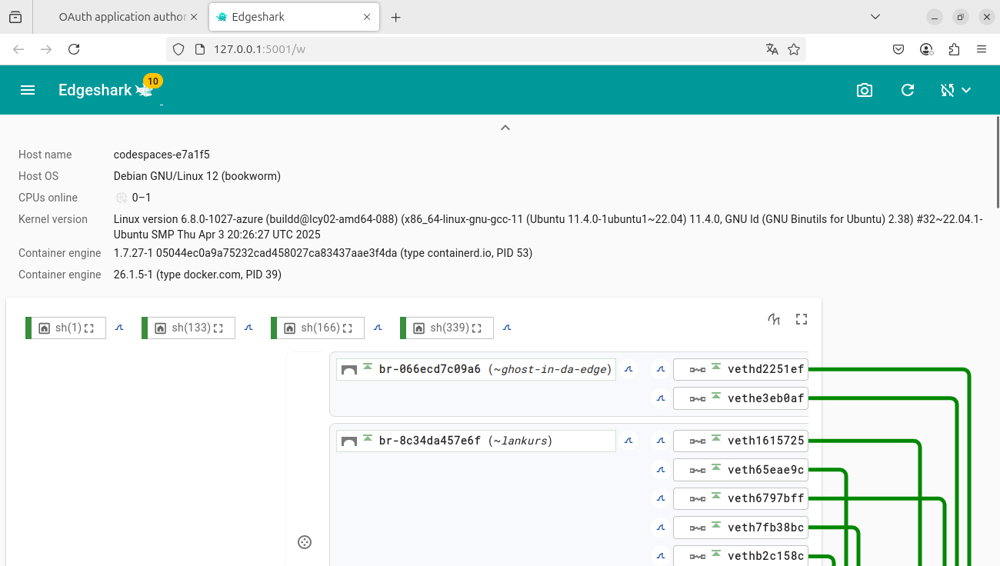

Der erfolgreiche Start kann bei Bedarf geprüft werden, indem man die _Edgeshark_ Startseite aufruft. Nach dem Start von _Edgeshark_ wird unten rechts im Webbrowser

## Ping-Befehl zwischen PC1 und PC3 starten

- Shell-Verbindung zu PC1 aufbauen (Attach)
- Ping-Befehl in der Shell von PC1 starten

??? info "Screenshots: _Attach Shell PC1 und Ping starten_"
    
    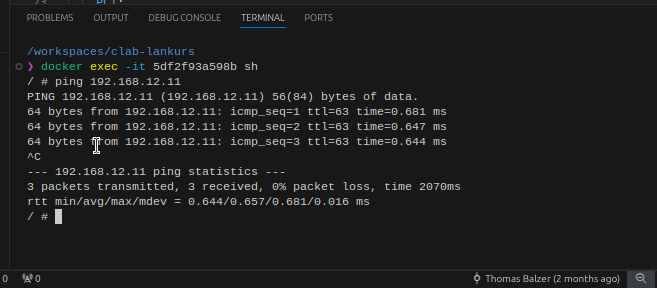

## Ping-Pakete zwischen PC1 und PC3 mit Wireshark aufzeichen

- Interface-Ansicht von PC1 im Bereich `RUNNING LABS` aufklappen
- Rechtsklick auf Interface `eth1`
- Im Kontektmenü von PC1 `Capture interface (Edgeshark)` auswählen
- Der Network Packet Analyzer Wireshark wird gestartet und zeichnet die von PC1 ausgehenden Ping-Pakete auf

!!! info
    Die PCs in den _Containerlab_ Labs haben zwei Interfaces:

    - `eth0`: Containerlab Management Interface
    - `eth1`: Mit Labornetzwerk verbundenes Interace

??? info "Screenshots: _Ping-Pakete mit Wireshark aufzeichnen_"
    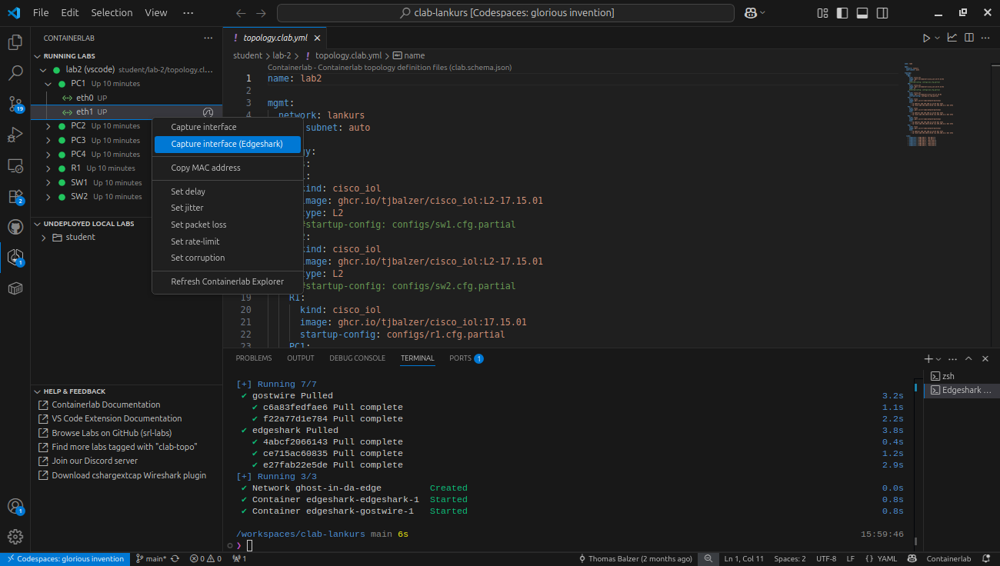
    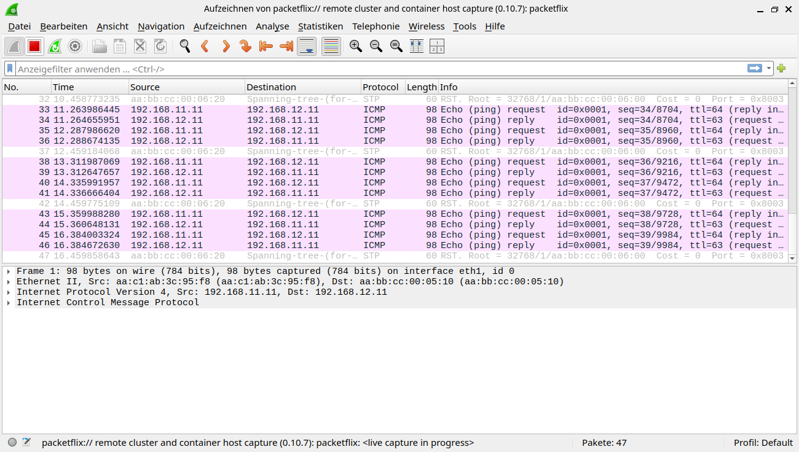

## Ping-Befehl und Wireshark-Aufzeichnung stoppen

- Im Terminalfenster von PC1 im Bereich `TERMINAL` über ++ctrl+c++ den Ping-Befehl beenden
- Wiresharkaufzeichnung über das rote Stopp-Symbol in der Symbolleiste von Wireshark beenden (Aufzeichnung kann bei Bedarf über das Symbol der blauen Haifischflosse wieder gestartet werden)

??? info "Screenshots: _Aufgezeichnete Ping-Pakete anzeigen_"
    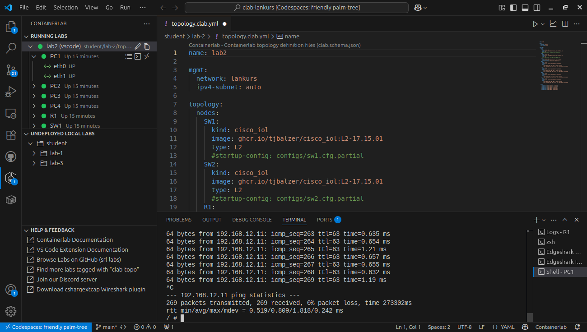
    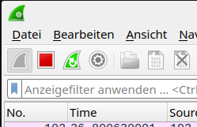
    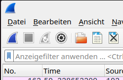

## Paketaufbau Ping Request Paket

Im aufgezeichneten Ping Request Paket (Paket-Nr. 3) sind die einzelnen Paketbestandteile zu sehen. Im der oberen Hälfte des Fensters wird die Paketliste angezeigt, in der unteren Hälfte die Details des in der Pakeztliste selektierten Pakets.

Im Detailfenster erkennt man die wesentlichen Bestandteile von Datenpaketen im Netzwerk:

- Ethernet Frame mit MAC-Adressem (Quell- und Zieladresse)
- IP Paket mit IP-Adressen (Quell- und Zieladresse)
- Payload, hier: ICMP Ping Request (Type 8, Code 0)

Ein Ping Request 

??? info "Screenshots: _Paket-Details ping Request_"
    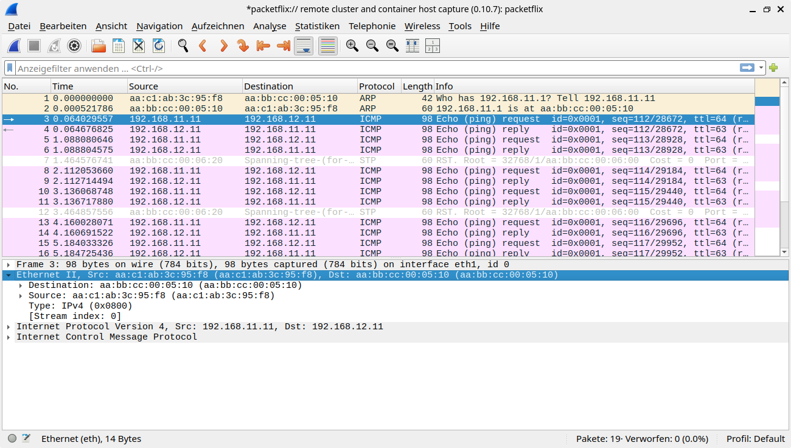
    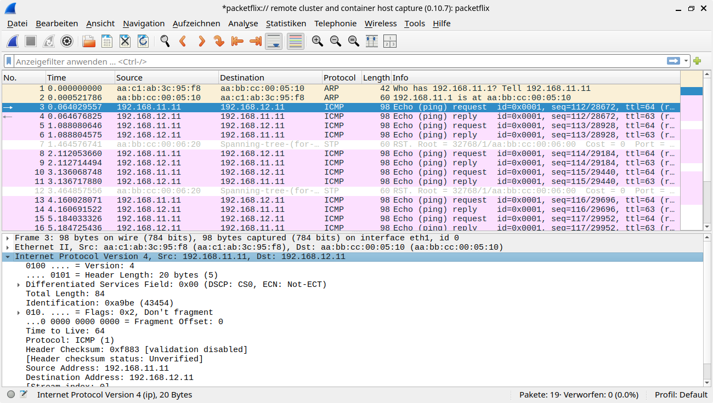
    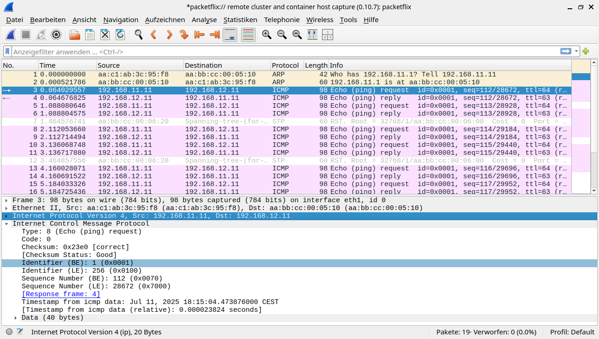

## Paketaufbau Ping Reply Paket

Die Details der Anwort der Gegenstelle auf das Ping-Paket (Ping-Reply in Paket-Nr. 4) sind analog aufgebaut. Auch finden wir:

- Ethernet Frame mit MAC-Adressem (Quell- und Zieladresse)
- IP Paket mit IP-Adressen (Quell- und Zieladresse)
- Payload, hier: ICMP Ping Reply (Type 0, Code 0)

??? info "Screenshots: _Paket-Details ping Reply_"
    

## Containerlab _Lab-2_ stoppen (Destroy)

Das gestartete Labor kann über die Auswahl des Befehls `Destroy` im Kontextmenü von Lab-2 im Bereich `RUNNING LABS` beendet werden.

??? info "Screenshot: _Stopp (Desroy) Lab-2_"
    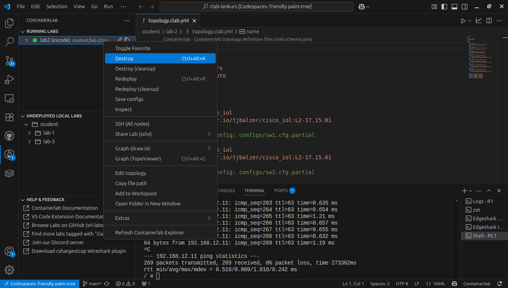
    

!!! warning
    Wird dss Containerlab Labor nicht gestoppt, wird es nach einem Neustart des GitHub Codespaces automatisch wieder gestartet. Wurde das Labor vor dem Beenden des Codespaces gestoppt, wird es beim Neustart des Codespaces nicht automatisch wieder gestartet.

!!! tip
    Am Ende einr Laborübung das Containerlab stoppen, um beim Neustart des Codespaces vor der Bearbeitung einer neuen Laborübung wieder die gleichen Bedingungen vorzufinden.

## _Edgeshark_ stoppen

Edgeshark wird bei Bedarf wie folgt gestoppt:

- _VS Code Command Palette_ über ++ctrl+shift+p++ aufrufen
- `edgeshark` in der Eingabezeile der _VS Code Command Palette_ eingeben
- Befehl `Containerlab: Uninstall Edgeshark` aus der Liste auswählen
- Edgeshark Container wird gestoppt

??? info "Screenshots: _Edgeshark im GitHub Codespace stoppen_"
    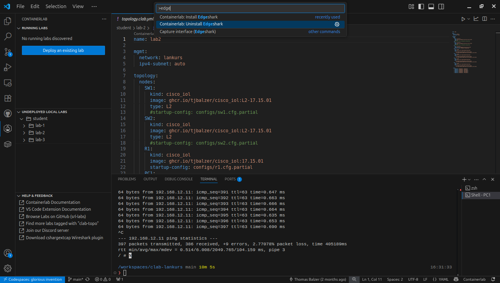
    

!!! warning
    Wird Edgeshark nicht gestoppt, wird er nach einem Neustart des GitHub Codespaces automatisch wieder gestartet. Wurde der Edgeshark Container vor dem Beenden des Codespaces gestoppt, bleibt der Edgeshark Container bei erneuten Start gestoppt.

!!! tip
    Am Ende einr Laborübung Edgeshark stoppen, um beim Neustart des Codespaces vor der Bearbeitung einer neuen Laborübung wieder die gleichen Bedingungen vorzufinden.

## GitHub Codespace stoppen (VS Code)

- Auf Fläche `>< Codespaces: <Name des Codespaces>` unten links in VS Code klicken
- Im angezeigten Menü `Stop Current Codespace` auswählen
- Codespace mit Containerlab Simulationsumgebung wird gestoppt

??? info "Screenshots: _Stopp Codespace (VS Code)_"
    
    
    
    
