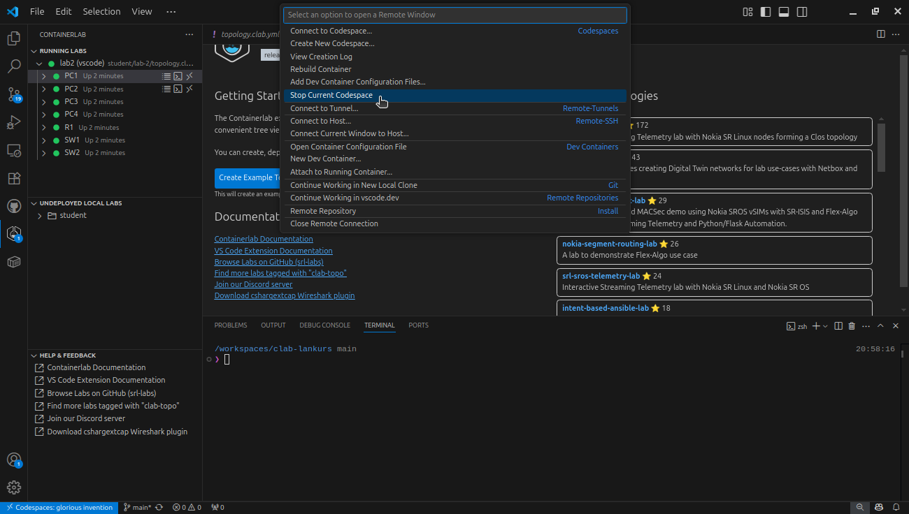

# Lab 1: Containerlab & Wireshark

Der [Network Protocol Analyzer _Wireshark_](https://wireshark.org) ist die am meisten genutzte Software für die Netzwerk Paketanalyse. Wireshark ist ein Open Source Programm, das für private und kommerzielle Zwecke frei genutzt werden kann. Ein Network Protcol Analyzer kann Netzwerk Pakete aufzeichnen sowie die in den Paketen übertragenen Netzwerkprotokolle analysieren und unterstützt Netzwerkadminstratoren somit bei der Fehlersuche. Die Funktionen von Wireshark sind auch hervoragend geeignet, um den Aufbau von Netzwerkframes, -paketen und -segmenten sowie die Funktionsweise von Netzwerkprotokollen auf den verschieden Schichten des ISO/OSI Modells darzustellen, weshalb _Wireshark_ hervorragend für Ausbildungszwecke geeignet ist.

In dieser Übung gehen wir die ersten Schritte mit Wireshark. Hierzu arbeiten wir wieder mit Containerlab im GitHub Codespace, starten ein Labornetzwerk und zeichen mit Wireshark einen _Ping_ von PC1 nach PC3 auf.

!!! info
    Der _Ping-Befehl_ basiert auf dem _ICMP-Protokoll_, welches im Rahmen dieses Kurses zu einem späteren Zeitpunkt detailliert behandelt wird. Für den Moment soll genügen, dass der Ping-Befehl genutzt werden kann, um z.B. die Funktion einer Netzwerkverbindung zwischen zwei Endgeräten im Netzwerk zu überprüfen. Hierzu schickt ein Endgerät einen sog. _Ping-Request_ an ein anderes Endgerät im Netzwerk. Funktioniert die Netzwerkverbindung, erreicht der Ping-Request des ersten Endgeräts das zweite Endgerät und letzteres antwortet auf den empfangenen _Ping-Request_ mit einem _Ping-Reply_ an das erste Endgerät.

    Ein Ping, z.B. von PC1 nach PC3 wird auf der Kommandozeile von PC1 durch die Eingabe des Befehls `ping 192.168.12.11` gestartet, wobei `192.168.12.11` die IP-Adresse von PC3 darstellt, über welche PC3 für andere Endgeräte im Netzwerk erreichbar ist.

/// caption
Lab Topology
///

Die dafür notwendigen Schritte sind:

- GitHub Codespace starten
- Containerlab _Lab-2_ starten (Deploy)
- Mit Kommandozeile vn PC1 verbinden
- Ping-Befehl zwischen PC1 und PC3 starten
- Ping-Pakete zwischen PC1 und PC3 mit Wireshark aufzeichen
- Ping-Befehl stoppen
- Containerlab _Lab-2_ stoppen (Destroy)
- GitHub Codespace stoppen

!!! note
    Die notwendigen Vorgehensweisen zum Handling des Codspaces sowie das Starten und Stoppen von Containerlab Topologien wurden in _Lab 0_ vorgestellt und in dieser Übung als bekannt vorausgesetzt. Bei Bedarf bitte die Beschreibung im [Kapitel zu Lab 0](lab0.md#lab-0-laborumgebung-mit-containerlab) als Referenz nutzen.

## GitHub Codespace und Lab-2 starten

GitHub Codespace und Containerlab Lab-2 analog der [Übung Lab 0](lab0.md#lab-0-laborumgebung-mit-containerlab) starten.

## Lab: Edgeshark im GitHub Codespace starten

Wireshark läuft im Rahmen dieses Kurses auf lokalen Notebooks im Schulungsraum. Da unsere Labornetzwerke entfernt in einem GitHub Codespace in der Microsoft Azure Cloud laufen, müssen wir dafür sorgen, dass die entfernten Netzwerkpakete an die lokale Wireshark-Instanz geschickt werden. Hierzu wird auf der entfernten virtuellen Maschine (der GitHub Codespace) die Open Source Software [Edgeshark](https://edgeshark.siemens.io) in Form eines Docker Container gestartet.

Edgeshark liest die Netzwerkpakete auf den Verbindungen der einzelnen Netzwerkcontainer in unserer Lab-2 Containerlab Topolology und überträgt die Pakete an das `cshargextcap`-Plugin von Wireshark auf dem lokalen Schulungs-PC oder Smart Client (auf den SmartClients wurde das `cshargextcap`-Plugin während der Durchführung der Maßnahmen in der Sektion [Vorbereitungen](vorbereitungen.md) installiert.

_Edgeshark_ wird über die [_VS Code_](https://code.visualstudio.com/) _Command Palette_ wie folgt im GitHub Codespace gestartet:

- _VS Code Command Palette_ über ++ctrl+shift+p++ aufrufen
- `edgeshark` in der Eingabezeile der _VS Code Command Palette` eingeben
- Befehl `Containerlab: Instll Edgeshark` aus der Liste auswählen
- Edgeshark Container wird bei Bedarf aus dem Internet geladen, lokal gespeichert und gestartet
- Nach dem erfolgreichen Start von _Edgeshark_ können Paketaufzeichnungen gestartet und die aufgezeichneten Paket lokal in Wireshark angzeigt werden (Wireshark wird automatisch nach dem Start der Paketaufzeichnung im entfernten Containerlab Labor lokal gestartet)

??? info "Screenshots: _Edgeshark im GitHub Codespace starten_"
    
    
    

Der erfolgreiche Start kann bei Bedarf geprüft werden, indem man die _Edgeshark_ Startseite aufruft. Nach dem Start von _Edgeshark_ wird unten rechts im Webbrowser

## Lab-2 und GitHub Codespace stoppen

Containerlab Lab-2 und GitHub Codespace analog der [Übung Lab 0](lab0.md#lab-0-laborumgebung-mit-containerlab) stoppen.
