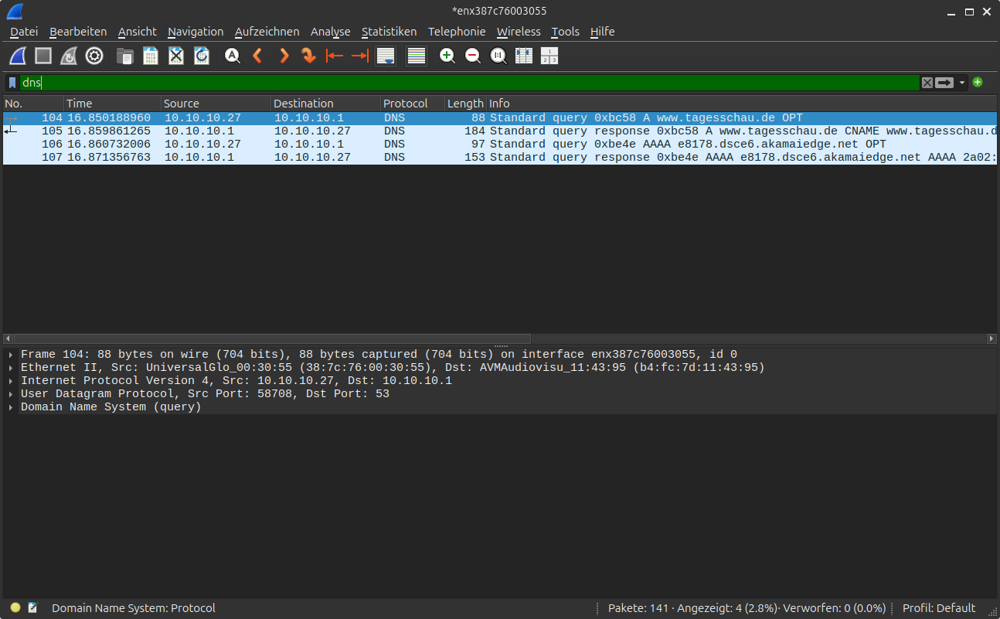

# Lab 7: User Datagram Protocol (UDP)

Quelle: Orginalaufgabe als Ergänzung zu „Computer Networking: A Top-Down Approach“, 8. Auflage von J.F. Kurose und K.W. Ross (ins Deutsche übersetzt mit Hilfe von ChatGPT).

© 2005–2021, J.F. Kurose und K.W. Ross. Alle Rechte vorbehalten.

## Einführung

In diesem Labor werfen wir einen kurzen Blick auf das **UDP-Transportprotokoll**.  

Wie im Kurs beschrieben, ist UDP ein sehr schlankes und unkompliziertes Protokoll ohne viel Schnickschnack.

Weil UDP so einfach ist, wird auch dieses Wireshark-Lab sehr kompakt sein – perfekt, wenn du in 30 Minuten schon den nächsten Termin hast.

!!! note
    An dieser Stelle solltest du schon ein geübter **Wireshark-Anwender** sein. Deshalb sind die Schritte hier nicht mehr so detailliert beschrieben wie in früheren Labs. Screenshots werden auch nicht mehr für jeden Schritt geliefert.

## Aufgabe

- Starte die Paketerfassung in Wireshark auf deinem lokalen PC (Smart Client oder Schulungs-Notebook)
- Erzeuge anschließend Verkehr, der dafür sorgt, dass dein Rechner **mehrere UDP-Pakete** sendet und empfängt.  

!!! note
    Selbst wenn du einfach „nur“ Wireshark laufen lässt, ist es sehr wahrscheinlich, dass du UDP-Pakete siehst. Zum Beispiel verwendet das **Domain Name System (DNS)** zur Auflösung von Namen in IP-Adressen für Abfragen und Antworten.

!!! tip "Tipp"
    Du kannst dafür auch explizit den Befehl **nslookup** verwenden. Damit rufst du den DNS-Dienst auf, der UDP-Pakete zwischen deinem Rechner und dem DNS-Server austauscht.

**nslookup** gibt es unter Windows, macOS und Linux. Du startest es einfach in deinem Terminal oder der Eingabeaufforderung:

### Beispiel-Aufruf `nslookup`


/// caption
Ablauf `nslookup`
///

Hier ein Beispiel von einem Linux-Rechner an der University of Massachusetts (Host newworld.cs.umass.edu), bei dem die IP-Adresse von www.nyu.edu abgefragt wird:

```
tom@X1:~$ nslookup www.enbw.de
Server:		10.10.10.1
Address:	10.10.10.1#53

Non-authoritative answer:
www.enbw.de	canonical name = enbw.de.
Name:	enbw.de
Address: 195.35.76.193
```
Wir müssen hier aber gar nicht tiefer in **nslookup** oder **DNS** einsteigen. Das Ziel ist einfach, ein paar UDP-Segmente in Wireshark zu sehen – und versprochen: dieses Lab bleibt kurz und knackig!

## Ablauf

- Starte Wireshark und beginne mit der Paketerfassung
- Führe **nslookup** für einen Hostnamen aus, den du länger nicht besucht hast
- Stoppe danach die Aufzeichnung
- Setze in Wireshark den Filter so, dass nur UDP-Pakete angezeigt werden: `udp`
- Wähle ein **UDP-Segment** aus und erweitere im Detailfenster die UDP-Felder

### Beispiel



!!! tip
    Falls du keine UDP-Pakete in deinem eigenen Trace findest oder Wireshark nicht live nutzen kannst, kannst du ein Beispiel-Tracefile herunterladen:  
    [http://gaia.cs.umass.edu/wireshark-labs/wireshark-traces-8.1.zip](http://gaia.cs.umass.edu/wireshark-labs/wireshark-traces-8.1.zip)

    Nutze die Datei `dns-wireshark-trace1-1.pcapng` zur Beantwortung der folgenden Fragen und lade sie über Datei öffnen in Wireshark.

## Analysefragen

1. Wähle das erste UDP-Segment in deinem Trace aus:
    * Welche Paketnummer hat es?[^1]
    * Welches Anwendungsprotokoll oder welcher Nachrichtentyp wird darin transportiert?  
    * Schau dir die Details im Wireshark-Fenster an:  
        * Wie viele Felder hat der UDP-Header?  
        * Wie heißen diese Felder?
2. Wie lang ist jedes Feld im UDP-Header (in Bytes)?  
    * Lies diese Information direkt in Wireshark ab
3. Der Wert im **Length-Feld** des UDP-Headers – was bedeutet er genau?  
    * Prüfe deine Vermutung an deinem aufgezeichneten Paket.
4. Was ist die maximale Zahl an Bytes, die ein UDP-Payload enthalten kann?  
    * Tipp: Das kannst du aus deiner Antwort zu 2. ableiten
5. Was ist die größte mögliche **Source-Portnummer**?  
    * Tipp: Auch hier hilft deine Antwort zu 4.
6. Welchen **Protokollnummer-Wert** hat UDP (im IP-Header)?  
    * Gib die Zahl **dezimal** an  
    * Schau dazu ins **Protokoll-Feld** des IP-Headers, der dein UDP-Segment enthält
7. Suche ein Paar von UDP-Paketen heraus:  
    * Das erste Paket ist die Anfrage von deinem Rechner
    * Das zweite Paket ist die Antwort darauf (erkennbar daran, dass Absender und Empfänger vertauscht sind)
    * Beantworte dazu die folgenden Fragen:
        * Welche Paketnummer hat das erste dieser beiden UDP-Segmente?[^1]  
        * Was ist der Wert im **Source-Port-Feld**?  
        * Was ist der Wert im **Destination-Port-Feld**?  
        * Welche Paketnummer hat das Antwortpaket?[^1]
        * Welche Werte haben **Source-Port** und **Destination-Port** im zweiten Paket?  
        * Beschreibe die Beziehung der Portnummern zwischen Anfrage und Antwort.

[^1]: Bitte beachten, dass die _Paketnummer_ von Wireshark hinzugefügt wird, um die Paketliste lesbarer zu machen und einen Bezug herzustellen. Diese Paketnummern gibt es in keinem realen Paketheader. 