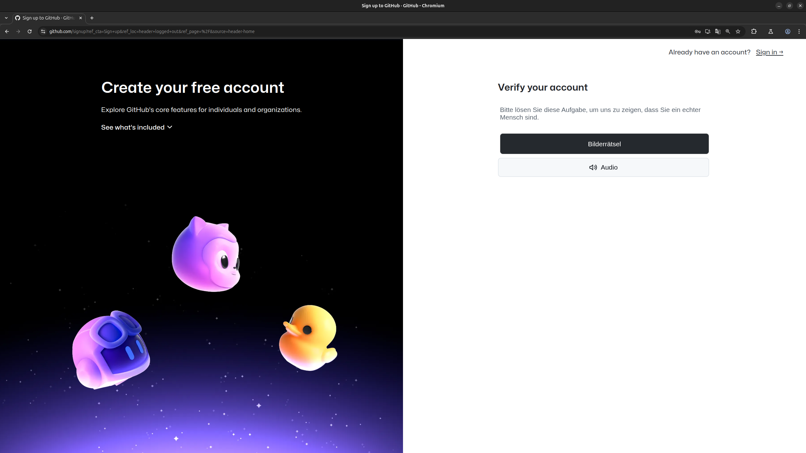
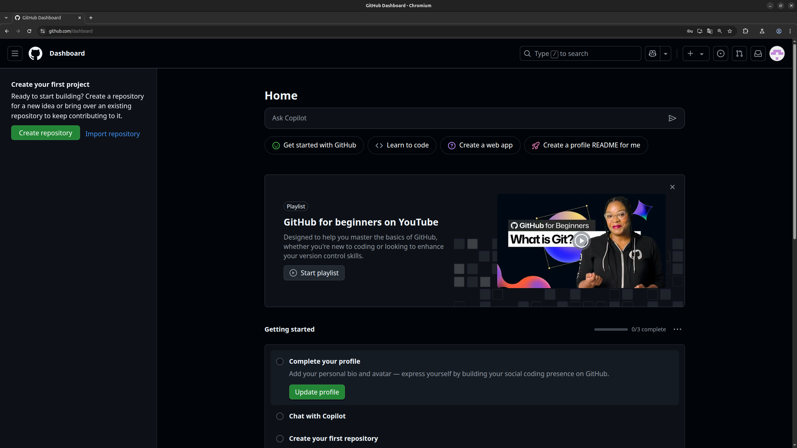

# Vorbereitungen für die Netzerksimulationen und Übungen

Die Übungen für den Netzwerk-Kurs werden über ein GitHub-Repository zur Verfügung gestellt. Mit Hilfe von virtualisierten _Cisco IOS Images_, welche in _Docker Containern_ ausgeführt werden, erfolgt die Simulation von Netzwerkgeräten (Router und Switches). Als Simulationsumgebung dient die Open Source Software [_Containerlab_](https://Github.com/hellt/containerlab) von Nokia, welche die Container orchestriert. Der Aufbau eines simulierten Netzwerkes wird in einer sogenannten Topology-Datei in YAML-Syntax beschrieben, welche _Containerlab_ beim Start eines Labs einliest.

Die Laborübungen ie Netzwerk-Simulationen laufen in sog. [Dev Containern](https://docs.github.com/en/codespaces/setting-up-your-project-for-codespaces/adding-a-dev-container-configuration/introduction-to-dev-containers) auf [GitHub Codespaces](https://docs.github.com/en/codespaces). _GitHub Codespaces_ sind virtuelle Maschinen, die auf GitHub gehostet werden und angepasst an die benötigte Systemumgebung in einem _GitHub Repository_ angelegt werden können. Ein kostenloser GitHub Account enthält derzeit (Juni 2025) monatlich 60 CPU-Stunden für die Nutzung von Codespace.

Um dies zu ermöglichen, benötigt jeder Kursteilnehmer einen eigenen GitHub-Account und eine Kopie (Fork) des entsprechenden GitHub-Repositories mit den [Netzwerkübungen](https://github.com/tjbalzer/clab-lankurs).

### GitHub Sign-up

!!! info
    Bereits bestehende GitHub-Accounts der Teilnehmer können ebenfalls genutzt werden. In diesem Fall weiter im Abschnitt [Installation von Wireshark auf dem SmartClient](vorbereitungen.md#installation-von-wireshark-auf-dem-smartclient).

Ein GitHub Account wird wie folgt angelegt:

#### GitHub-Startseite in Webbrowser öffnen

[GitHub-Startseite](https://gigthub.com) in Webbrowser öffnen und Sign-up Button auswählen:

#### Benutzername und Passwort anlegen

- E-Mail Adresse eintragen
- Passwort eintragen und merken 🙂
- Gewünschten Usernamen eingeben (GitHub prüft Verfügbarkeit, Usernamen ggf. anpassen)
- Country/Region _Germany_ auswählen
- Button _Continue_ auswählen

#### GitHub Account verifizieren

Der neue GitHub Account wird nun verifziert (hier am Beispiel _Bilderrätsel_ dargestellt):

- Button _Bilderrätsel_ auswählen
- Im rechten Bild angezeigte Grafik über rechts/links-Pfeile solange ändern, bis sie den im Text dargestellten Vorgaben entspricht
- Auswahl über den Button _Absenden_ bestätigen
- Bestätigungsnachricht wird angezeigt, wenn die Auswahl korrekt war, ansonsten wird ein neues Bilderrätsel angezeigt

#### E-Mail Adresse bestätigen

Nach den Account Verifikation wird die E-Mail Adresse überprüft:

- Posteingang auf Nachricht von GitHub mit Bestätigungscode prüfen
- Bestätigungscode in den Feldern unter _Enter Code_ eintragen
- Eingabe über den Button _Continue_ abschließen (dadurch werden auch die GitHub _Terms of Service_ angenommen)
- Es folgt die Anzeige der GitHub Sign-in Seite

### GitHub Sign-in

Anmelden mit den Benutzerdaten des neu angelegten GitHub-Profils:

## _Forken_ des GitHub-Repositories für die Netzwerkübungen

Die Übungen werden über das GitHub Repository [clab-lankurs](https://github.com/tjbalzer/clab-lankurs) des GitHub Users _tjbalzer_ zur Verfügung gestellt. GitHub Codespaces werden einem GitHub-Repository zugeordnet und können nur vom Eigentümer des Repositories ausgeführt werden, wenn dieser mit seiner GitHub-Userid angemeldet ist. Deshalb muss das _clab-lankurs_ GitHub-Repository von der GitHub-Seite des GitHub-Nutzers _tjbalzer_ in das jeweilige GitHub-Konto jedes Kursteilnehmers kopiert (_geforkt_) werden.

Dieser _Fork_ des Original GitHub-Repositories wird wie folgt erstellt:

- Öffnen der GitHub-Webseite des _clab-lankurs_ Repositories: [https://github.com/tjbalzer/clab-lankurs](https://github.com/tjbalzer/clab-lankurs)

## Installation von Wireshark auf dem SmartClient

Soll statt eines Schulungs-Notebooks der persönliche EnBW Smart Client genutzt werden, muss zusätzliche Software auf dem Smart Client installiert werden.

!!! info
    Vorraussetzung: Der Schulungsteilnehmer muss über Adminrechte auf dem Smart Client verfügen.

